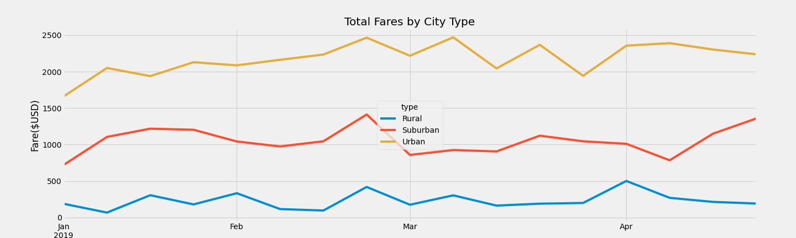

# PyBer Analysis

## Overview of the Analysis

The purpose of this mock assignment was to conduct an exploratory analysis for a Python based ride-sharing app company named PyBer. Python, Pandas, and Matplotlib was used to analyze and visualize the ride-sharing data. PyBer's ride-sharing raw data was provided by several CSV files, one of which contained over two thousand rows. 

Large files are extremely difficult to reveal complex findings through tables of thousands of rows––the result may not be informative or appealing. Because the analytical work required to be comprehensive and correct, Matplotlib was the suitable tool to produce line charts, pie charts and graphs. 

The main goal of the analysis was to create visualizations of the data in order to detect patterns and correlations. The outcome of the analysis may enable the company to make strategic business decisions to improve access and affordability to their ride-sharing services. The following information was used to detect the findings:

- Types of cities
- Total drivers and rides
- Average fare per driver
- Average percentage of fares, and per ride
- Total weekly fares for each type of city

## Resources

For this project, three CSV files were provided. The files contained data on cities' ride data and its types of cities (e.g., urban, suburban, rural). To analyze the data, Jupyter Notebook and Pandas was used to inspect the data, merge data sets, perform calculations, and create Data Series and Data Frames. Matplotlib, was used to produce high quality publication figures to create the charts and graphs. 

## Results

The line charts created for this assignment showed a reasonable pattern in rural, suburban and urban cities' total fare amount over time. It is important to note that all cities had a similar spike in total fares towards the end of February. The majority of total fares were seen in urban cities, followed by suburban and rural, respectively. 

Urban fares were slightly cheaper compared to suburban and rural fares. However, it had 2,400 drivers compared to 625 for suburban, and 125 for rural. As a result, urban cities made more money ($39,854) in total fares compared to suburban cities ($19,356) and rural cities ($4,328)––fares were higher in price. 

Total rides were also higher in urban cities, compared to suburban and rural cities. The observation showed that because there were more drivers and riders in urban cities, it may have caused the price of fares to be lower, possibly due to competition. Rural fares were higher, possibly due to the of length of ride, which was not given.

## Fig. 1

## Fig. 2

## Fig. 3

## FIG. 4

## FIG. 5

## Fig. 6

## Fig. 7

## Fig. 8

## Fig. 9

## Recommendation

More analysis should be done. Although several sheets  of data were provided with a lot information, important details were left out (e.g., length of rides, gas prices). The lack of information possibly skewed the results of the analysis. The length of the rides and  price of gas should have been included in the data in order to assess/determine the company's ride-sharing service affordability. 

